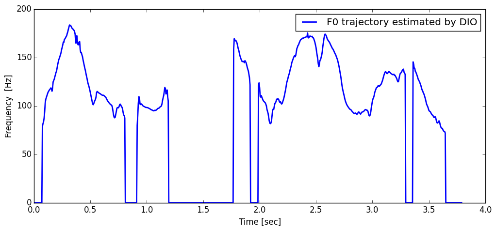
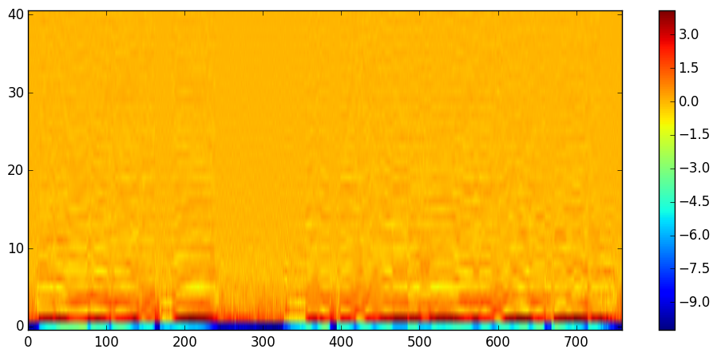

# WORLD.jl

[](https://travis-ci.org/r9y9/WORLD.jl)
[](https://coveralls.io/r/r9y9/WORLD.jl?branch=master)

WORLD.jl is a Julia wrapper for WORLD - a high-quality speech analysis, modification and synthesis system. WORLD provides a way to decompose a speech signal into

- Fundamental frequency (F0)
- spectral envelope
- excitation signal (or aperiodicy used in TANDEM-STRAIGHT)

and re-synthesize a speech signal from these paramters. See [here](http://ml.cs.yamanashi.ac.jp/world/english/index.html) for the original WORLD.

## Supported Platforms

- Linux
- Mac OS X

Note that the original WORLD works in windows as well. In order to use WORLD.jl in windows, you have to build WORLD yourself since currently we don't have a installation script.

## Installation

Run the following commands on your julia interactive settion (REPL):

```julia
julia> Pkg.add("WORLD")
```

if you want the latest master, run

```julia
julia> Pkg.clone("https://github.com/r9y9/WORLD.jl")
julia> Pkg.build("WORLD")
```

All dependencies are resolved with `Pkg.clone` and `Pkg.build`.

## Usage

### Basic setup

```julia
w = World(fs, period) # fs might be 16000, 22100 or 44100, period is a frame period in msec.
```

This is not necessary but might be useful. The composite type `World` just holds sampling frequency and frame period that are used in almost all of WORLD functions. You can call WORLD functions directly as well.

Suppose `x::Vector{Float64}` is a input monoral speech signal like


### F0 estimation and refinement

#### DIO

```julia
opt = DioOption(80.0, 640, 2.0, period, 4) # f0floor, f0ceil, channels in octave, period, speed
f0, timeaxis = dio(w, x, opt=opt) # or you can write `dio(x, fs, opt=opt)` without using composite type `World`
```



#### StoneMask

```julia
f0 = stonemask(w, x, timeaxis, f0)
```


### Spectral envelope estimation

#### CheapTrick

```julia
spectrogram = cheaptrick(w, x, timeaxis, f0)
```


### Excitation signal estimation

#### Platinum

```julia
residual = platinum(w, x, timeaxis, f0, spectrogram)
```

Note that the result is spectrum of excitation signal.

### Synthesis

```julia
y = synthesis(w, f0, spectrogram, residual, length(x))
```


### Aperiodicity ratio estimation

```julia
aperiodicity = aperiodicityratio(w, x, f0, timeaxis)
```


### Synthesis from aperiodicity

```julia
y = synthesis_from_aperiodicity(w, f0, spectrogram, aperiodicity, length(x))
```


### Compact speech parameterization

Raw spectrum envelop and aperiodicity spectrum are relatively high dimentional (offen more than 513 or 1023) so one might want to get more compact representation. To do so, mel-cepstrum could be a good choice. As far as I know, this would be useful in statistical speech synthesis and statistical voice conversion.

#### spectrum envelope to mel-cepstrum

```julia
mc = sp2mc(spectrogram, order, α) # e.g. order=40, α=0.41
```

`order` is the order of mel-cepstrum (except for 0th) and α is a frequency warping parameter which often used in mel-cepstrum definition.



#### mel-cepstrum to spectrum envelope

```julia
approximate_spectrogram = mc2sp(mc, α, get_fftsize_for_cheaptrick(fs))
```


#### aperiodicity spectrum to aperiodicity mel-cesptrum

```julia
ap_mc = sp2mc(aperiodicity, order, α) # e.g. order=40, α=0.41
```


**NOTE**: HTS v2.3 beta seems to parameterize aperiodicity spectrum in this way (but does this really make sense?).

#### aperiodicity mel-cepstrum to aperiodicity spectrum

```julia
approximate_aperiodicity = mc2sp(ap_mc, α, get_fftsize_for_cheaptrick(fs))
```


For the complete code of visualizations shown above, please check [the ijulia notebook](http://nbviewer.ipython.org/github/r9y9/WORLD.jl/blob/master/examples/Demonstration%20of%20WORLD.jl.ipynb).
